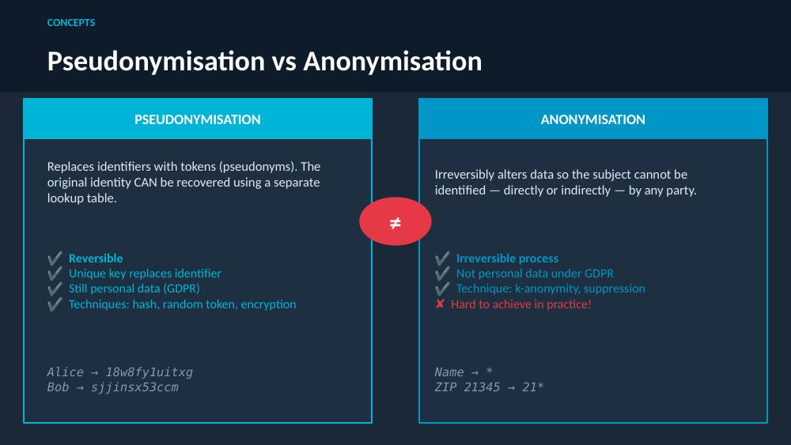
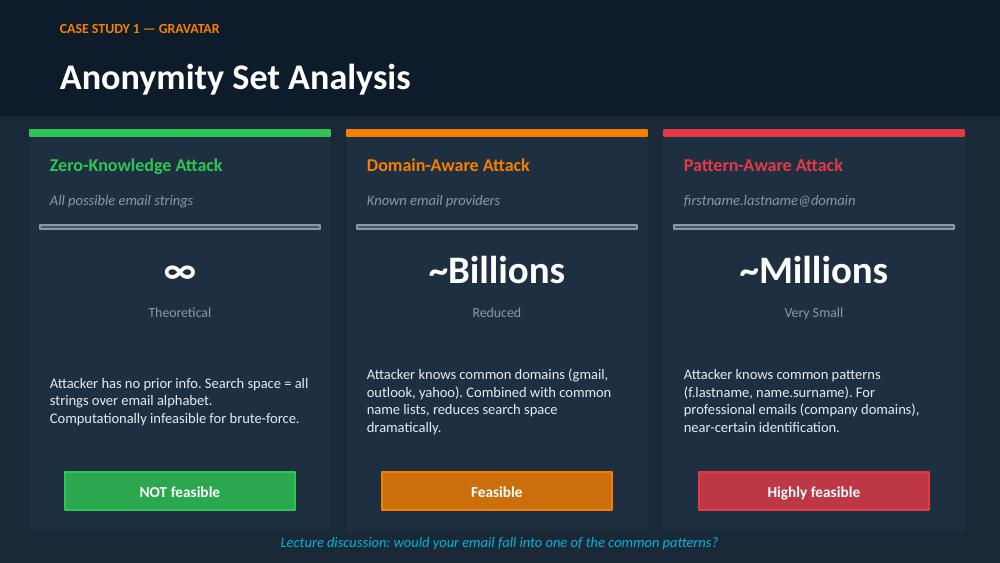
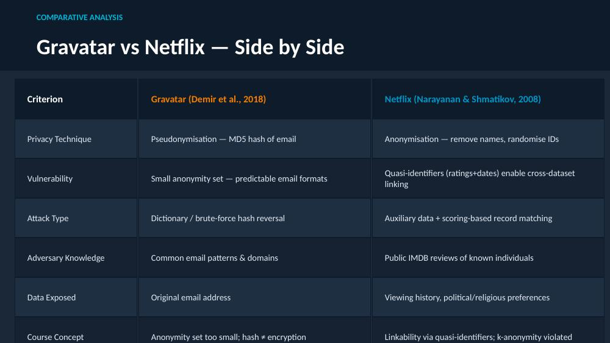

# Data Security & Privacy: Privacy-Enhancing Technologies

Coursework portfolio for **1DT114 Data Security & Privacy**, Uppsala University — covering all five course modules: secure multiparty computation, homomorphic encryption, pseudonyms & anonymity, differential privacy, and adversarial ML / federated learning.

The seminar in Module 3 was presented with Muhammad Agus (Group M3.4). All notebooks and analysis are my own follow-up work built on the lecture material; the lecture slides themselves are the instructor's copyrighted teaching material and are not reproduced here — each section below is written in my own words, with the original references cited.

## Module 1 — Secure Multiparty Computation (MPC)

**Core idea:** let *n* parties jointly compute a function of their private inputs — e.g. "who is richer?" or "what's our combined total?" — without any party revealing their input to the others, and without a trusted third party.

- **Security goals:** confidentiality (no one learns more than their own input/output), correctness, fairness, and robustness against dishonest participants.
- **Building blocks:**
  - *Oblivious Transfer (OT)* — the sender holds two messages, the receiver picks one to learn, and neither party learns anything more (not which message was sent, not the message not chosen).
  - *Secret sharing* — a value is split into shares distributed across parties so that no subset below a threshold can reconstruct it, but enough shares together can.
  - *Garbled circuits* — a way to jointly evaluate a Boolean circuit gate-by-gate, using OT for each input wire, without revealing intermediate values.
- **Shamir Secret Sharing:** a secret is encoded as the constant term of a random polynomial; any *k* of *n* shares reconstruct it via **Lagrange interpolation**, while fewer than *k* shares reveal nothing.

**Notebook:** [`Lagrange.ipynb`](Lagrange.ipynb) — implements and visualises Lagrange basis polynomials and interpolation, the mathematical mechanism that makes secret reconstruction in Shamir's scheme possible.

*References: Yao (1982); Goldreich, Micali & Wigderson (1987).*

## Module 2 — Homomorphic Encryption

**Core idea:** perform computation directly on encrypted data, so a server can evaluate a function for a client without ever seeing the plaintext.

- **Partially homomorphic schemes** support one operation indefinitely — e.g. RSA and ElGamal support multiplication, Goldwasser-Micali supports addition (on bits).
- **Fully homomorphic encryption (FHE)** supports arbitrary computation, at the cost of **noise growth**: every homomorphic operation adds noise to the ciphertext, and decryption only works while that noise stays below a threshold.
- **Gentry's breakthrough (2009):** *bootstrapping* — homomorphically evaluating the decryption function itself under encryption, refreshing a "noisy" ciphertext into a "fresh" one with lower noise, without ever exposing the plaintext. This turned a noise-limited "somewhat homomorphic" scheme into a genuinely fully homomorphic one.
- **Applications:** confidential cloud computation, privacy-preserving analytics on sensitive (e.g. medical) data, private ML inference, e-voting, and encrypted search.

**Notebook:** [`Fully_homomorphic_encryption.ipynb`](Fully_homomorphic_encryption.ipynb) — a toy Gentry-style model exploring the modular arithmetic behind FHE: how `c = b + kp mod p` recovers `b` regardless of `k`, and how the same idea extends (`c = b + 2r + kp mod p`) to model noise growth and the limits of correct decryption.

*References: Rivest, Adleman & Dertouzos (1978); Gentry (2009).*

## Module 3 — Pseudonyms & Anonymity *(presented seminar)*

Presented with Muhammad Agus. Covers two real-world privacy failures against the formal definitions of pseudonymisation, anonymisation, and k-anonymity.

- **Pseudonymisation** replaces identifiers with tokens — *reversible* via a lookup table, and still personal data under GDPR.
- **Anonymisation** irreversibly removes identifiability — very hard to achieve in practice, since remaining attributes often act as quasi-identifiers.

**Case Study 1 — Gravatar hashing attack** (Demir et al., 2018): Gravatar links avatars to emails via `MD5(email)`. Because email formats are predictable, an attacker can build a dictionary of likely addresses and match hashes — recovering the original email without ever breaking MD5 itself. The lesson: **the hash function was never broken; the anonymity set was just too small.**

**Case Study 2 — Netflix Prize de-anonymization** (Narayanan & Shmatikov, 2008): Netflix released 100M+ "anonymised" ratings. Matching just 6–8 ratings against public IMDb reviews was enough to re-identify a subscriber — exposing viewing habits and, by extension, political and religious preferences.

**K-anonymity** requires every record to share its quasi-identifiers with at least *k−1* others, but can still fail via homogeneity attacks, background knowledge, or the sparse-data problem (extension: l-diversity).

**Notebook:** [`empirical_study_pseudonyms_anonymity_1.ipynb`](empirical_study_pseudonyms_anonymity_1.ipynb) — applies these concepts to a synthetic dataset: pseudonymising emails via SHA-256, simulating a dictionary attack to recover them, identifying quasi-identifier combinations that uniquely identify individuals, and applying k-anonymity (ZIP generalisation, age bucketing) to measurably reduce that risk.

*References: Demir et al. (2018); Narayanan & Shmatikov (2008); Sweeney (2002); Pfitzmann & Hansen (2008); Machanavajjhala et al. (2007).*

## Module 4 — Differential Privacy

**Core idea:** a randomised mechanism is differentially private if its output distribution barely changes whether or not any single individual's record is included — so an observer cannot tell if a specific person's data was used.

- **Formal definition:** a mechanism *M* is (ε, δ)-differentially private if, for any two databases differing in one record ("adjacent databases"), the probability of any output changes by at most a factor of `exp(ε)` (plus δ). Smaller ε means stronger privacy but noisier answers — the central **privacy/utility trade-off**.
- **Mechanisms:**
  - *Randomised response* — for binary survey answers, flip a coin to decide whether to answer truthfully or randomly, giving each respondent plausible deniability while still allowing accurate aggregate statistics.
  - *Laplace mechanism* — adds noise drawn from a Laplace distribution scaled to a query's sensitivity, for numeric queries (mean, sum, count).
  - *Gaussian mechanism* — an alternative for numeric queries, scaled to ℓ₂-sensitivity, at the cost of a small δ (not purely ε-differentially private).
  - *Exponential mechanism* — for selecting among discrete/categorical options, weighted by a utility function.
- **Composition:** differentially private mechanisms compose — combining an ε₁-DP and an ε₂-DP mechanism yields (ε₁+ε₂)-DP overall, and post-processing a DP output never weakens its privacy guarantee.
- **Local vs central DP:** the central model trusts a curator to add noise before releasing results; the local model has each individual add noise on their own device before anything is shared, trusting no one.

*References: Dwork & Roth (2014), The Algorithmic Foundations of Differential Privacy; Warner (1965); Wagner & Eckhoff (2018).*

## Module 5 — Adversarial ML & Federated Learning *(presented seminar)*

**Federated learning (FedML)** trains a shared model across many clients' local data without the data ever leaving each device — only model updates (gradients) are sent to a central server and averaged (**FedAvg**, McMahan et al., 2016). Google's Gboard keyboard is the canonical example: keystrokes never leave the phone, only gradient updates do.

- **Privacy is not automatic.** Sharing gradients instead of raw data reduces exposure but doesn't eliminate it — a malicious participant can run a **GAN-based reconstruction attack** (Hitaj et al.) to recover other participants' training samples purely from shared model parameters. Strong differential-privacy noise degrades reconstruction quality but doesn't eliminate the attack at moderate privacy budgets.
- **Enhancing privacy in FedML:** differential privacy (noisy gradients, local or central), homomorphic encryption (server aggregates without ever decrypting), secure multiparty computation (no single party sees individual updates, no trusted server needed), and secure hardware enclaves (e.g. Intel SGX).
- **The core tension:** secure aggregation (MPC/HE) hides individual updates for privacy — but that also makes it impossible for the server to *detect* a malicious gradient. Privacy and security pull in opposite directions.
- **Poisoning attacks:** a malicious client can scale up its update to inject a backdoor (classic example: a stop sign with a sticker misclassified as a speed-limit sign), directly invert the gradient ("flip sign"), or — most subtly — the **"A Little Is Enough" (ALIE)** attack (Baruch et al., 2019) places malicious updates just inside the honest distribution (mean ± 1.3σ), making them statistically indistinguishable from benign ones.
- **Robust aggregation defenses:** coordinate-wise median or trimmed mean (drop the *f* largest/smallest values per coordinate), **Krum** (Blanchard et al., 2017 — selects the single gradient most consistent with its nearest neighbours), and **FedLAW** (Parsa et al., ICLR 2026), which jointly optimises aggregation weights and model parameters rather than doing binary outlier rejection. ALIE specifically breaks Krum, since it's designed to look statistically "consistent."

**Adversarial examples** flip the usual optimisation: instead of fixing inputs and optimising model weights, fix the weights and optimise the *input* — finding the smallest perturbation `δx` that changes the model's prediction (untargeted: any misclassification; targeted: a specific class `t`). Perceptibility is measured via ℓ₀/ℓ₁/ℓ₂/ℓ∞ distance metrics, each encoding a different constraint on how a perturbation can spread across the input.

- **FGSM** (Goodfellow et al., 2015) — a fast, single-step attack in the direction of the loss gradient's sign. Cheap but weak; visible at large ε.
- **Carlini & Wagner (CW, 2017)** — a stronger optimisation-based attack (using Adam) that finds near-invisible perturbations by maximising the target class's logit over all others. The canonical demo: a VGG11 model classifies a Samoyed dog as a platypus after adding imperceptible noise.
- **Model extraction / black-box attacks** (Papernot et al., 2017): when an attacker lacks white-box access, they query the target model to build a labelled surrogate, train a substitute model, and craft adversarial examples on it — which often **transfer** to the real target, enabling white-box-style attacks against a black-box API.
- **Defenses are losing an arms race:** detection, gradient masking, adversarial training, and defensive distillation have each been proposed and subsequently broken by adaptive adversaries. There is no provable robustness guarantee at scale yet.

**The thread connecting both halves:** security and privacy are fundamentally in tension in distributed ML, and nearly every defense opens a new attack surface — hiding gradients for privacy makes poisoning harder to catch; catching poisoning requires visibility that undermines privacy.

*References: McMahan et al. (FedAvg, 2016); Hitaj, Ateniese & Perez-Cruz (GAN leakage); Bagdasaryan et al. (Backdoor FL, 2019); Baruch et al. (ALIE, 2019); Blanchard et al. (Krum, NIPS'17); Parsa et al. (FedLAW, ICLR 2026); Goodfellow et al. (FGSM, 2015); Carlini & Wagner (CW, 2017); Papernot et al. (Model Extraction, 2017).*

## Contents

- `Lagrange.ipynb` — Module 1: Lagrange interpolation underlying Shamir Secret Sharing
- `Fully_homomorphic_encryption.ipynb` — Module 2: toy FHE noise/modulo exploration
- `pseudonyms_anonymity_with_notes.pptx` — Module 3: presented seminar slides with speaker notes
- `empirical_study_pseudonyms_anonymity_1.ipynb` — Module 3: empirical follow-up study
- `M5_Seminar_Summary.docx` — Module 5: presented seminar summary & discussion guide (federated learning + adversarial ML)
- `images/` — diagrams from the Module 3 seminar deck
